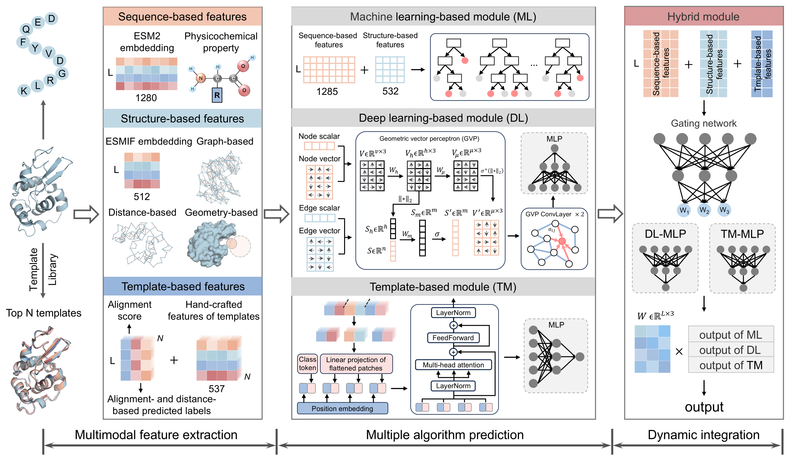

# Description
DynaBCE is dynamic ensemble algorithm to effectively identify conformational B-cell epitopes by leveraging feature- and template-based methods. Using novel structural descriptors and embeddings from language models, we built machine learning and deep learning modules based on boosting algorithms and geometric graph neural networks, respectively. Meanwhile, we created a template module by combining similar antigen structures and transformer-based algorithms to capture antibody binding signatures. Finally, we designed a gating network to dynamically assign the weights of three modules for each residue to yield its integrative prediction result.   
  

# Usage
## Installation 
1. Clone the repository to your local device.
   ```shell
    git clone https://github.com/hzau-liulab/DynaBCE   
    cd DynaBCE
   ```
2. Install the necessary dependencies.
   * Python packages
        python  3.9.17   
        Numpy  1.25.0    
        Pandas  1.2.0   
        Biopython  1.76    
        Scipy  1.10.1  
        cdhit-reader  0.1.1     
        fair-esm  2.0.0     
        pytorch  1.12.1     
        pyg  2.3.1
    * Third-party software
        DSSP https://swift.cmbi.umcn.nl/gv/dssp/    
        PSAIA https://psaia.software.informer.com/download/
        GHECOM https://pdbj.org/ghecom/  
        TM-align https://zhanggroup.org/TM-align/  
        NW-align https://zhanggroup.org/NW-align/ 


# Database requirement
BCE633 dataset and
Manually created template library [Google Drive](https://drive.google.com/file/d/1z1xSP5U5GkCvLTmrMAnlxp8qUMspBr9y/view?usp=sharing)

# Important python packages
  
GraphRicciCurvature  0.5.3.1    

# Usage
## 1. Download pre-trained models
The pre-trained models can be found at [Google Drive](https://drive.google.com/file/d/1z1xSP5U5GkCvLTmrMAnlxp8qUMspBr9y/view?usp=sharing)
## 2. Configuration
Creat DynaBCE environment (conda env create -f environment.yaml).  
Manually download and install the third-party software listed above.  
Change the paths of these softwares and related databases at arg_parse.py     
Activate DynaBCE environment (conda activate DynaBCE).  
## 3. Prediction
Run the following command:  

    python DynaBCE_model.py --pdb ./data/BCE633/7zyi_A.pdb --outdir ./output 

Type -h for help information:

    python DynaBCE_model.py -h

# Citation
Dynamic integration of feature- and template-based methods improves the prediction of conformational B-cell epitopes. *Submitted*, 2024.
